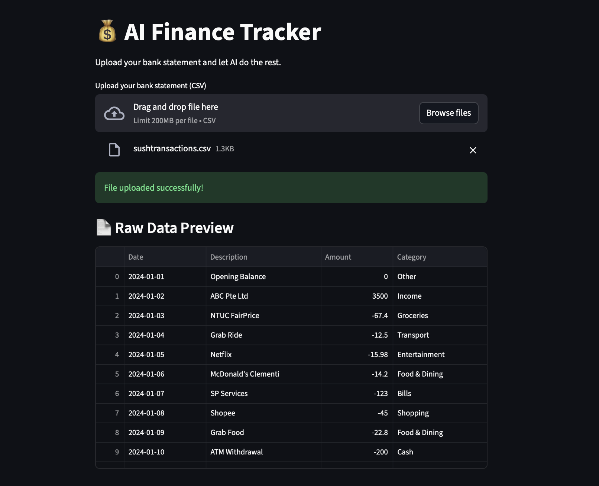
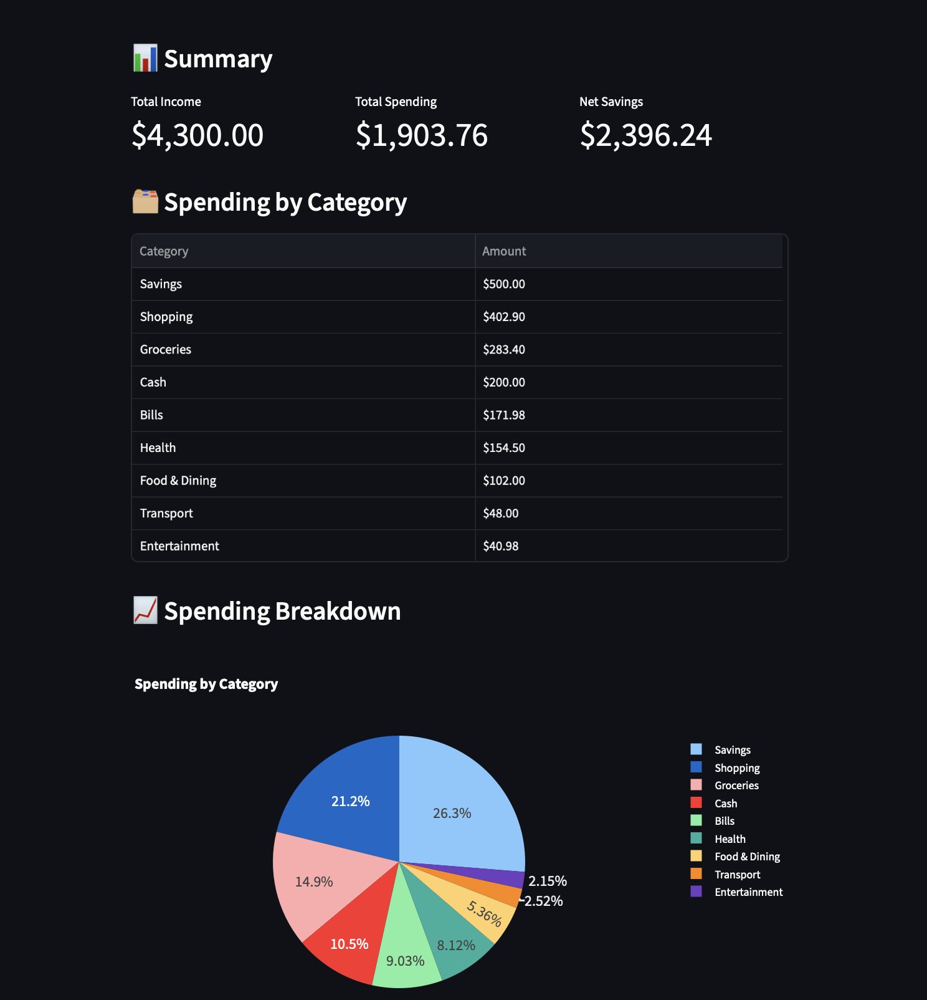

# AI Finance Tracker
Any bank. Any format. One smart dashboard.

A Streamlit web app that takes a raw bank statement CSV from DBS, OCBC or any other bank — and turns it into a categorized, visual spending dashboard. 

## How it works

1. **Upload** — drag in any bank statement CSV.
2. **Structure detection** — the raw CSV is sent to Claude which identifies where the actual data starts, and which columns represent the date, description, and amount (or separate withdrawal/deposit columns). This makes the app bank-agnostic, since every bank exports CSVs differently.
3. **Parsing** — pandas uses Claude's output to load the CSV into a clean DataFrame with standardized `Date`, `Description`, and `Amount` columns. Withdrawals and deposits are combined into a single signed `Amount` column (negative for spending, positive for income).
4. **Description cleaning** — raw bank descriptions are often messy (e.g. `DEBIT PURCHASE xx-1635 SRI MURUGAN S30/03/26`). Claude extracts just the merchant name from each one (`Fairprice`), so the data is consistent regardless of which bank it came from.
5. **Categorization** — using prompt engineering, Claude assigns each cleaned transaction to a category (Food & Dining, Transport, Shopping, Bills, Groceries, etc.), with extra context provided for common Singapore merchants (NTUC, Sheng Siong, Mustafa, Cold Storage, and others).
6. **Dashboard** — the app calculates total income, total spending, and net savings, summarizes spending by category, and renders an interactive Plotly pie chart of the breakdown.

## Tech stack
- **Streamlit** — web interface and file upload
- **Pandas** — CSV parsing and data transformation
- **Plotly** — interactive spending visualizations
- **Anthropic Claude API** — CSV structure detection, description cleaning, and transaction categorization

## Setup

```bash
# Clone the repo
git clone https://github.com/YOUR_USERNAME/ai-finance-tracker.git
cd ai-finance-tracker

# Create and activate a virtual environment
python -m venv venv
source venv/bin/activate

# Install dependencies
pip install -r requirements.txt

# Add your Anthropic API key
echo "ANTHROPIC_API_KEY=your_key_here" > .env

# Run the app
streamlit run app.py
```

## Usage

1. Run the app and open it in your browser.
2. Upload a bank statement CSV.
3. View your categorized transactions, summary metrics, and spending breakdown chart.

## Screenshots




